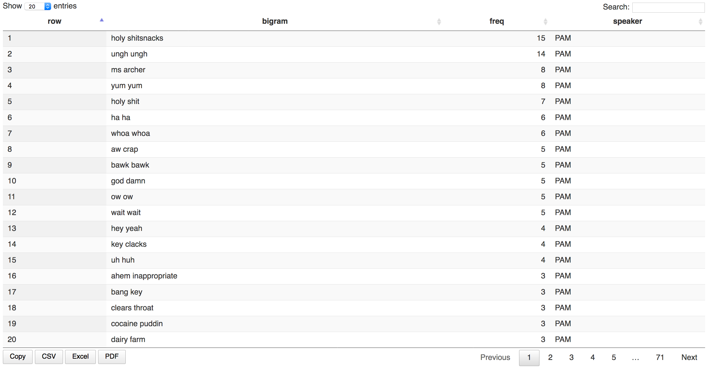

# Pamgrams and Bipams
Mara Averick  
`r Sys.Date()`  


```r
## load packages
library(tidyverse)
library(tidytext)
library(here)
```

Let's read in the Pam-bigram data (which you can access for your own amusement [here](https://gist.github.com/batpigandme/7fd3266451392d0310ebefd0bc472c0f)).


```r
## read csv file
pam_bigrams <- read_csv("data/pam_bigrams.csv")
```

Now we'll use the `sample_n()` function from `dplyr` to get 15 (though you could use any number) observations/rows from our pamgram data. Note that the `freq` variable contains the number of times a given bigram occurred in the "PAM" corpus (which, as of this writing, includes all of Archer, seasons 1 - 7).


```r
sample_n(pam_bigrams, 15)
```

```
## # A tibble: 15 x 3
##                bigram  freq speaker
##                 <chr> <int>   <chr>
##  1  hypnotized people     1     PAM
##  2      wooden stakes     1     PAM
##  3            pop pow     1     PAM
##  4   good's happening     1     PAM
##  5             wh hey     2     PAM
##  6    chuckling fluid     1     PAM
##  7       equal shares     1     PAM
##  8        life advice     1     PAM
##  9        people fill     1     PAM
## 10          holy shit     7     PAM
## 11        bionic legs     1     PAM
## 12 sterile conditions     1     PAM
## 13        coca fields     1     PAM
## 14      fister roboto     1     PAM
## 15           hunh unh     1     PAM
```

## Tables of Pam

Since pretty much every pair of words Pam utters is priceless, let's check out some of the different ways you can display data frames as [tables in R Markdown](http://rmarkdown.rstudio.com/lesson-7.html). If you're looking at this in markdown (`.md` file), what you see may not match the descriptions. This makes sense, and is worth paying attention to for things like GitHub's README.md files, and the like.

### `kable`

First, we might as well make use of the `knitr::kable` function, since we're knitting this document anyhow. Note that the chunk option `results='asis'` needs to be set so that our output isn't further processed by knitr when we pull our document together.[^1]


```r
library(knitr)
kable(sample_n(pam_bigrams, 15), caption = "kable pamgrams")
```


Table: kable pamgrams

bigram             freq  speaker 
----------------  -----  --------
gummi bears           1  PAM     
ike turner.i          1  PAM     
god hates             1  PAM     
boom ahem             1  PAM     
frickin zod           1  PAM     
suckin bullshit       1  PAM     
tinker toy            1  PAM     
claws rowr            1  PAM     
inspiring story       1  PAM     
leavin yer            1  PAM     
gal's love            1  PAM     
pinky swear           1  PAM     
yeah whatcha          1  PAM     
ha ha                 6  PAM     
heard coming          1  PAM     

Ok, we've got bold headers, and lines between rows -- basically, things are looking a little more _table-y_ than the did before. The [`kable()`](https://www.rdocumentation.org/packages/knitr/versions/1.15.1/topics/kable) function can take other formatting arguments, but we're just gonna leave it at the defaults here.

### `pander`

[`pander`](https://rapporter.github.io/pander/) is another R Pandoc writer. It supports [four Pandoc formats](https://rapporter.github.io/pander/#markdown-tables) for tables (which can be specified using `pandoc.table`[^2]), and you may or may not want to add some information about that in your frontmatter/YAML. You can also make more adjustments to your table formatting using [`panderOptions()`](https://rapporter.github.io/pander/#pander-options). 


```r
library(pander)
## multiline table by default
pandoc.table(sample_n(pam_bigrams, 5))
```

```
## 
## ------------------------------------
##       bigram         freq   speaker 
## ------------------- ------ ---------
##      pam's hot        1       PAM   
## 
##  separate sessions    1       PAM   
## 
##  dicknuts hrmmmff     1       PAM   
## 
##   kill decepticon     1       PAM   
## 
##      dump time        1       PAM   
## ------------------------------------
```

```r
## simple tables
pandoc.table(sample_n(pam_bigrams, 5), style = "simple")
```

```
## 
## 
##       bigram        freq   speaker 
## ------------------ ------ ---------
##   kills jermaine     1       PAM   
##    bodied woman      1       PAM   
##    dirty floor       1       PAM   
##   frazier's dumb     1       PAM   
##  explain compound    1       PAM
```


```r
## grid tables
pandoc.table(sample_n(pam_bigrams, 5), style = "grid")
```

```
## 
## 
## +-----------------+------+---------+
## |     bigram      | freq | speaker |
## +=================+======+=========+
## |   blow pam's    |  1   |   PAM   |
## +-----------------+------+---------+
## |  wan attorney   |  1   |   PAM   |
## +-----------------+------+---------+
## |  ass drowning   |  1   |   PAM   |
## +-----------------+------+---------+
## |    clock yer    |  1   |   PAM   |
## +-----------------+------+---------+
## | happenin sunday |  1   |   PAM   |
## +-----------------+------+---------+
```


```r
## rmarkdown tables (aka pipe table format)
pandoc.table(sample_n(pam_bigrams, 5), style = "rmarkdown")
```

```
## 
## 
## |    bigram     | freq | speaker |
## |:-------------:|:----:|:-------:|
## | quality dump  |  1   |   PAM   |
## | ingrown hairs |  1   |   PAM   |
## | pacman jones  |  2   |   PAM   |
## |   ekblad jr   |  1   |   PAM   |
## | wilfrid noyce |  1   |   PAM   |
```

There are a bunch of other options you can play around with as well, such as [captions](https://rapporter.github.io/pander/#caption), [cell highlighting](https://rapporter.github.io/pander/#highlight-cells), [cell alignment](https://rapporter.github.io/pander/#cell-alignment), and [width](https://rapporter.github.io/pander/#table-and-cell-width).

### `xtable`

The [`xtable`](http://crantastic.org/packages/xtable) package has been around for a while, and it has a _ton_ of formatting options for both LaTeX and HTML output. (Not to be confused with a _tonne_ of options, which -- how does one even measure formatting options in kilos?) The output defaults to latex, and, as with `kable`, we'll need to be sure to include `results="asis"` in our chunk options.


```r
library(xtable)
xpam <- xtable(sample_n(pam_bigrams, 15))
print(xpam, type="html")
```

<!-- html table generated in R 3.4.0 by xtable 1.8-2 package -->
<!-- Tue May 23 08:49:40 2017 -->
<table border=1>
<tr> <th>  </th> <th> bigram </th> <th> freq </th> <th> speaker </th>  </tr>
  <tr> <td align="right"> 1 </td> <td> thousand divided </td> <td align="right">   1 </td> <td> PAM </td> </tr>
  <tr> <td align="right"> 2 </td> <td> flow toilets </td> <td align="right">   1 </td> <td> PAM </td> </tr>
  <tr> <td align="right"> 3 </td> <td> marley chuckles </td> <td align="right">   1 </td> <td> PAM </td> </tr>
  <tr> <td align="right"> 4 </td> <td> cb handle </td> <td align="right">   1 </td> <td> PAM </td> </tr>
  <tr> <td align="right"> 5 </td> <td> forfeit league </td> <td align="right">   1 </td> <td> PAM </td> </tr>
  <tr> <td align="right"> 6 </td> <td> whatcha waiting </td> <td align="right">   1 </td> <td> PAM </td> </tr>
  <tr> <td align="right"> 7 </td> <td> dump time </td> <td align="right">   1 </td> <td> PAM </td> </tr>
  <tr> <td align="right"> 8 </td> <td> werewolf aw </td> <td align="right">   1 </td> <td> PAM </td> </tr>
  <tr> <td align="right"> 9 </td> <td> krieger's selling </td> <td align="right">   1 </td> <td> PAM </td> </tr>
  <tr> <td align="right"> 10 </td> <td> cocaine online </td> <td align="right">   1 </td> <td> PAM </td> </tr>
  <tr> <td align="right"> 11 </td> <td> balls taste </td> <td align="right">   1 </td> <td> PAM </td> </tr>
  <tr> <td align="right"> 12 </td> <td> low flow </td> <td align="right">   1 </td> <td> PAM </td> </tr>
  <tr> <td align="right"> 13 </td> <td> skinny lying </td> <td align="right">   1 </td> <td> PAM </td> </tr>
  <tr> <td align="right"> 14 </td> <td> phuh phuh </td> <td align="right">   3 </td> <td> PAM </td> </tr>
  <tr> <td align="right"> 15 </td> <td> downstairs neighbors </td> <td align="right">   1 </td> <td> PAM </td> </tr>
   </table>

Yeah, so, the default doesn't look so awesome right now. However, this is really just an HTML table, so it can be easily styled as such (in addition to using the `xtable` parameters).

### `huxtable`

Like `xtable`, [`huxtable`](https://hughjonesd.github.io/huxtable/) deals in both LaTeX and HTML, and has a ton of [properties](https://hughjonesd.github.io/huxtable/huxtable.html) you can adjust to your liking (you can even use the `magrittr`-style pipe operator, `%>%`, to do so). The number format defaults to two decimal places, so we'll set that manually here. In order for the column names to show up in your huxtable, they need to be added to the data frame itself. If you're working in R Markdown, it _will_ look like they show up twice, but that shouldn't be the case once you've knit your document.


```r
library(huxtable)
hpam <- hux(sample_n(pam_bigrams, 15)) %>%
  huxtable::add_colnames()
number_format(hpam) <- 0
hpam
```

<!--html_preserve--><table class="huxtable" style="border-collapse: collapse; width: 50%; margin-left: auto; margin-right: auto;">
<col style="width: NA;"><col style="width: NA;"><col style="width: NA;"><tr>
  <td  style="vertical-align: top; text-align: left; white-space: nowrap; border-width:0px 0px 0px 0px; border-style: solid; border-top-color: NA;  border-right-color: NA;  border-bottom-color: NA;  border-left-color: NA; padding: 4pt 4pt 4pt 4pt; ">bigram</td>
  <td  style="vertical-align: top; text-align: left; white-space: nowrap; border-width:0px 0px 0px 0px; border-style: solid; border-top-color: NA;  border-right-color: NA;  border-bottom-color: NA;  border-left-color: NA; padding: 4pt 4pt 4pt 4pt; ">freq</td>
  <td  style="vertical-align: top; text-align: left; white-space: nowrap; border-width:0px 0px 0px 0px; border-style: solid; border-top-color: NA;  border-right-color: NA;  border-bottom-color: NA;  border-left-color: NA; padding: 4pt 4pt 4pt 4pt; ">speaker</td>
</tr>
<tr>
  <td  style="vertical-align: top; text-align: left; white-space: nowrap; border-width:0px 0px 0px 0px; border-style: solid; border-top-color: NA;  border-right-color: NA;  border-bottom-color: NA;  border-left-color: NA; padding: 4pt 4pt 4pt 4pt; ">ringing happy</td>
  <td  style="vertical-align: top; text-align: left; white-space: nowrap; border-width:0px 0px 0px 0px; border-style: solid; border-top-color: NA;  border-right-color: NA;  border-bottom-color: NA;  border-left-color: NA; padding: 4pt 4pt 4pt 4pt; ">1</td>
  <td  style="vertical-align: top; text-align: left; white-space: nowrap; border-width:0px 0px 0px 0px; border-style: solid; border-top-color: NA;  border-right-color: NA;  border-bottom-color: NA;  border-left-color: NA; padding: 4pt 4pt 4pt 4pt; ">PAM</td>
</tr>
<tr>
  <td  style="vertical-align: top; text-align: left; white-space: nowrap; border-width:0px 0px 0px 0px; border-style: solid; border-top-color: NA;  border-right-color: NA;  border-bottom-color: NA;  border-left-color: NA; padding: 4pt 4pt 4pt 4pt; ">krieger shuckin</td>
  <td  style="vertical-align: top; text-align: left; white-space: nowrap; border-width:0px 0px 0px 0px; border-style: solid; border-top-color: NA;  border-right-color: NA;  border-bottom-color: NA;  border-left-color: NA; padding: 4pt 4pt 4pt 4pt; ">1</td>
  <td  style="vertical-align: top; text-align: left; white-space: nowrap; border-width:0px 0px 0px 0px; border-style: solid; border-top-color: NA;  border-right-color: NA;  border-bottom-color: NA;  border-left-color: NA; padding: 4pt 4pt 4pt 4pt; ">PAM</td>
</tr>
<tr>
  <td  style="vertical-align: top; text-align: left; white-space: nowrap; border-width:0px 0px 0px 0px; border-style: solid; border-top-color: NA;  border-right-color: NA;  border-bottom-color: NA;  border-left-color: NA; padding: 4pt 4pt 4pt 4pt; ">steering wheel's</td>
  <td  style="vertical-align: top; text-align: left; white-space: nowrap; border-width:0px 0px 0px 0px; border-style: solid; border-top-color: NA;  border-right-color: NA;  border-bottom-color: NA;  border-left-color: NA; padding: 4pt 4pt 4pt 4pt; ">1</td>
  <td  style="vertical-align: top; text-align: left; white-space: nowrap; border-width:0px 0px 0px 0px; border-style: solid; border-top-color: NA;  border-right-color: NA;  border-bottom-color: NA;  border-left-color: NA; padding: 4pt 4pt 4pt 4pt; ">PAM</td>
</tr>
<tr>
  <td  style="vertical-align: top; text-align: left; white-space: nowrap; border-width:0px 0px 0px 0px; border-style: solid; border-top-color: NA;  border-right-color: NA;  border-bottom-color: NA;  border-left-color: NA; padding: 4pt 4pt 4pt 4pt; ">list uh</td>
  <td  style="vertical-align: top; text-align: left; white-space: nowrap; border-width:0px 0px 0px 0px; border-style: solid; border-top-color: NA;  border-right-color: NA;  border-bottom-color: NA;  border-left-color: NA; padding: 4pt 4pt 4pt 4pt; ">1</td>
  <td  style="vertical-align: top; text-align: left; white-space: nowrap; border-width:0px 0px 0px 0px; border-style: solid; border-top-color: NA;  border-right-color: NA;  border-bottom-color: NA;  border-left-color: NA; padding: 4pt 4pt 4pt 4pt; ">PAM</td>
</tr>
<tr>
  <td  style="vertical-align: top; text-align: left; white-space: nowrap; border-width:0px 0px 0px 0px; border-style: solid; border-top-color: NA;  border-right-color: NA;  border-bottom-color: NA;  border-left-color: NA; padding: 4pt 4pt 4pt 4pt; ">phone call</td>
  <td  style="vertical-align: top; text-align: left; white-space: nowrap; border-width:0px 0px 0px 0px; border-style: solid; border-top-color: NA;  border-right-color: NA;  border-bottom-color: NA;  border-left-color: NA; padding: 4pt 4pt 4pt 4pt; ">1</td>
  <td  style="vertical-align: top; text-align: left; white-space: nowrap; border-width:0px 0px 0px 0px; border-style: solid; border-top-color: NA;  border-right-color: NA;  border-bottom-color: NA;  border-left-color: NA; padding: 4pt 4pt 4pt 4pt; ">PAM</td>
</tr>
<tr>
  <td  style="vertical-align: top; text-align: left; white-space: nowrap; border-width:0px 0px 0px 0px; border-style: solid; border-top-color: NA;  border-right-color: NA;  border-bottom-color: NA;  border-left-color: NA; padding: 4pt 4pt 4pt 4pt; ">pretty sad</td>
  <td  style="vertical-align: top; text-align: left; white-space: nowrap; border-width:0px 0px 0px 0px; border-style: solid; border-top-color: NA;  border-right-color: NA;  border-bottom-color: NA;  border-left-color: NA; padding: 4pt 4pt 4pt 4pt; ">1</td>
  <td  style="vertical-align: top; text-align: left; white-space: nowrap; border-width:0px 0px 0px 0px; border-style: solid; border-top-color: NA;  border-right-color: NA;  border-bottom-color: NA;  border-left-color: NA; padding: 4pt 4pt 4pt 4pt; ">PAM</td>
</tr>
<tr>
  <td  style="vertical-align: top; text-align: left; white-space: nowrap; border-width:0px 0px 0px 0px; border-style: solid; border-top-color: NA;  border-right-color: NA;  border-bottom-color: NA;  border-left-color: NA; padding: 4pt 4pt 4pt 4pt; ">paper stuck</td>
  <td  style="vertical-align: top; text-align: left; white-space: nowrap; border-width:0px 0px 0px 0px; border-style: solid; border-top-color: NA;  border-right-color: NA;  border-bottom-color: NA;  border-left-color: NA; padding: 4pt 4pt 4pt 4pt; ">1</td>
  <td  style="vertical-align: top; text-align: left; white-space: nowrap; border-width:0px 0px 0px 0px; border-style: solid; border-top-color: NA;  border-right-color: NA;  border-bottom-color: NA;  border-left-color: NA; padding: 4pt 4pt 4pt 4pt; ">PAM</td>
</tr>
<tr>
  <td  style="vertical-align: top; text-align: left; white-space: nowrap; border-width:0px 0px 0px 0px; border-style: solid; border-top-color: NA;  border-right-color: NA;  border-bottom-color: NA;  border-left-color: NA; padding: 4pt 4pt 4pt 4pt; ">amazing driver</td>
  <td  style="vertical-align: top; text-align: left; white-space: nowrap; border-width:0px 0px 0px 0px; border-style: solid; border-top-color: NA;  border-right-color: NA;  border-bottom-color: NA;  border-left-color: NA; padding: 4pt 4pt 4pt 4pt; ">1</td>
  <td  style="vertical-align: top; text-align: left; white-space: nowrap; border-width:0px 0px 0px 0px; border-style: solid; border-top-color: NA;  border-right-color: NA;  border-bottom-color: NA;  border-left-color: NA; padding: 4pt 4pt 4pt 4pt; ">PAM</td>
</tr>
<tr>
  <td  style="vertical-align: top; text-align: left; white-space: nowrap; border-width:0px 0px 0px 0px; border-style: solid; border-top-color: NA;  border-right-color: NA;  border-bottom-color: NA;  border-left-color: NA; padding: 4pt 4pt 4pt 4pt; ">frickin starving</td>
  <td  style="vertical-align: top; text-align: left; white-space: nowrap; border-width:0px 0px 0px 0px; border-style: solid; border-top-color: NA;  border-right-color: NA;  border-bottom-color: NA;  border-left-color: NA; padding: 4pt 4pt 4pt 4pt; ">1</td>
  <td  style="vertical-align: top; text-align: left; white-space: nowrap; border-width:0px 0px 0px 0px; border-style: solid; border-top-color: NA;  border-right-color: NA;  border-bottom-color: NA;  border-left-color: NA; padding: 4pt 4pt 4pt 4pt; ">PAM</td>
</tr>
<tr>
  <td  style="vertical-align: top; text-align: left; white-space: nowrap; border-width:0px 0px 0px 0px; border-style: solid; border-top-color: NA;  border-right-color: NA;  border-bottom-color: NA;  border-left-color: NA; padding: 4pt 4pt 4pt 4pt; ">pam hangs</td>
  <td  style="vertical-align: top; text-align: left; white-space: nowrap; border-width:0px 0px 0px 0px; border-style: solid; border-top-color: NA;  border-right-color: NA;  border-bottom-color: NA;  border-left-color: NA; padding: 4pt 4pt 4pt 4pt; ">1</td>
  <td  style="vertical-align: top; text-align: left; white-space: nowrap; border-width:0px 0px 0px 0px; border-style: solid; border-top-color: NA;  border-right-color: NA;  border-bottom-color: NA;  border-left-color: NA; padding: 4pt 4pt 4pt 4pt; ">PAM</td>
</tr>
<tr>
  <td  style="vertical-align: top; text-align: left; white-space: nowrap; border-width:0px 0px 0px 0px; border-style: solid; border-top-color: NA;  border-right-color: NA;  border-bottom-color: NA;  border-left-color: NA; padding: 4pt 4pt 4pt 4pt; ">stayin alive</td>
  <td  style="vertical-align: top; text-align: left; white-space: nowrap; border-width:0px 0px 0px 0px; border-style: solid; border-top-color: NA;  border-right-color: NA;  border-bottom-color: NA;  border-left-color: NA; padding: 4pt 4pt 4pt 4pt; ">1</td>
  <td  style="vertical-align: top; text-align: left; white-space: nowrap; border-width:0px 0px 0px 0px; border-style: solid; border-top-color: NA;  border-right-color: NA;  border-bottom-color: NA;  border-left-color: NA; padding: 4pt 4pt 4pt 4pt; ">PAM</td>
</tr>
<tr>
  <td  style="vertical-align: top; text-align: left; white-space: nowrap; border-width:0px 0px 0px 0px; border-style: solid; border-top-color: NA;  border-right-color: NA;  border-bottom-color: NA;  border-left-color: NA; padding: 4pt 4pt 4pt 4pt; ">hai hai</td>
  <td  style="vertical-align: top; text-align: left; white-space: nowrap; border-width:0px 0px 0px 0px; border-style: solid; border-top-color: NA;  border-right-color: NA;  border-bottom-color: NA;  border-left-color: NA; padding: 4pt 4pt 4pt 4pt; ">2</td>
  <td  style="vertical-align: top; text-align: left; white-space: nowrap; border-width:0px 0px 0px 0px; border-style: solid; border-top-color: NA;  border-right-color: NA;  border-bottom-color: NA;  border-left-color: NA; padding: 4pt 4pt 4pt 4pt; ">PAM</td>
</tr>
<tr>
  <td  style="vertical-align: top; text-align: left; white-space: nowrap; border-width:0px 0px 0px 0px; border-style: solid; border-top-color: NA;  border-right-color: NA;  border-bottom-color: NA;  border-left-color: NA; padding: 4pt 4pt 4pt 4pt; ">monster truck</td>
  <td  style="vertical-align: top; text-align: left; white-space: nowrap; border-width:0px 0px 0px 0px; border-style: solid; border-top-color: NA;  border-right-color: NA;  border-bottom-color: NA;  border-left-color: NA; padding: 4pt 4pt 4pt 4pt; ">1</td>
  <td  style="vertical-align: top; text-align: left; white-space: nowrap; border-width:0px 0px 0px 0px; border-style: solid; border-top-color: NA;  border-right-color: NA;  border-bottom-color: NA;  border-left-color: NA; padding: 4pt 4pt 4pt 4pt; ">PAM</td>
</tr>
<tr>
  <td  style="vertical-align: top; text-align: left; white-space: nowrap; border-width:0px 0px 0px 0px; border-style: solid; border-top-color: NA;  border-right-color: NA;  border-bottom-color: NA;  border-left-color: NA; padding: 4pt 4pt 4pt 4pt; ">wait till</td>
  <td  style="vertical-align: top; text-align: left; white-space: nowrap; border-width:0px 0px 0px 0px; border-style: solid; border-top-color: NA;  border-right-color: NA;  border-bottom-color: NA;  border-left-color: NA; padding: 4pt 4pt 4pt 4pt; ">2</td>
  <td  style="vertical-align: top; text-align: left; white-space: nowrap; border-width:0px 0px 0px 0px; border-style: solid; border-top-color: NA;  border-right-color: NA;  border-bottom-color: NA;  border-left-color: NA; padding: 4pt 4pt 4pt 4pt; ">PAM</td>
</tr>
<tr>
  <td  style="vertical-align: top; text-align: left; white-space: nowrap; border-width:0px 0px 0px 0px; border-style: solid; border-top-color: NA;  border-right-color: NA;  border-bottom-color: NA;  border-left-color: NA; padding: 4pt 4pt 4pt 4pt; ">guido sardoochbag</td>
  <td  style="vertical-align: top; text-align: left; white-space: nowrap; border-width:0px 0px 0px 0px; border-style: solid; border-top-color: NA;  border-right-color: NA;  border-bottom-color: NA;  border-left-color: NA; padding: 4pt 4pt 4pt 4pt; ">1</td>
  <td  style="vertical-align: top; text-align: left; white-space: nowrap; border-width:0px 0px 0px 0px; border-style: solid; border-top-color: NA;  border-right-color: NA;  border-bottom-color: NA;  border-left-color: NA; padding: 4pt 4pt 4pt 4pt; ">PAM</td>
</tr>
</table>
<!--/html_preserve-->

Though it's a bit clunky for such simple output, there are [more options](https://hughjonesd.github.io/huxtable/huxtable.html#more-formatting), such as conditional formatting, as well as some very fine-tuned controls that may make `huxtable` a good choice for you.

### `printr`

[Yihui Xie](https://yihui.name), the author of `knitr`, and a bevy of [other useful R packages](https://github.com/yihui/) (including most of the ones ending in "-down"), also created the [`printr`](https://yihui.name/printr/) package as a "companion" to knitr. And, as far as data frames, tibbles, and the like go, the output will look the same as it does using `kable()` without `printr` attached. However, it _will_ make a difference in terms of the way things like matrices, or lists of vignettes, and datasets are displayed.


```r
library(printr)
kable(sample_n(pam_bigrams, 15), caption = "printr pamgrams")
```


Table: printr pamgrams

bigram             freq  speaker 
----------------  -----  --------
smelly ass            1  PAM     
sister edie           3  PAM     
bailed triflin        1  PAM     
heh head              1  PAM     
follow kenny          1  PAM     
matter ya             1  PAM     
whatcha waiting       1  PAM     
snacks enable         1  PAM     
legally binding       1  PAM     
horn honks            1  PAM     
disease means         1  PAM     
hunh unh              1  PAM     
quick learner         1  PAM     
yagoat raping         1  PAM     
masturbate til        1  PAM     


```r
vignette(package = "printr")
```


Table: Vignettes in printr

Item     Title                                                
-------  -----------------------------------------------------
printr   An Introduction to the printr Package (source, html) 

### `DT`

[`DT`](http://rstudio.github.io/DT/), from RStudio, provides _"an R interface to the DataTables library."_ It's different from the other options discussed here, as it creates an [HTML widget](http://gallery.htmlwidgets.org/) in which it displays the data. This means that it can be interactive-- so, explore all the great Pam-ness, below.


```r
library(DT)
datatable(pam_bigrams)
```

<!--html_preserve--><div id="htmlwidget-9ab6b0460767cb57b263" style="width:100%;height:auto;" class="datatables html-widget"></div>
<script type="application/json" data-for="htmlwidget-9ab6b0460767cb57b263">{"x":{"filter":"none","data":[["1","2","3","4","5","6","7","8","9","10","11","12","13","14","15","16","17","18","19","20","21","22","23","24","25","26","27","28","29","30","31","32","33","34","35","36","37","38","39","40","41","42","43","44","45","46","47","48","49","50","51","52","53","54","55","56","57","58","59","60","61","62","63","64","65","66","67","68","69","70","71","72","73","74","75","76","77","78","79","80","81","82","83","84","85","86","87","88","89","90","91","92","93","94","95","96","97","98","99","100","101","102","103","104","105","106","107","108","109","110","111","112","113","114","115","116","117","118","119","120","121","122","123","124","125","126","127","128","129","130","131","132","133","134","135","136","137","138","139","140","141","142","143","144","145","146","147","148","149","150","151","152","153","154","155","156","157","158","159","160","161","162","163","164","165","166","167","168","169","170","171","172","173","174","175","176","177","178","179","180","181","182","183","184","185","186","187","188","189","190","191","192","193","194","195","196","197","198","199","200","201","202","203","204","205","206","207","208","209","210","211","212","213","214","215","216","217","218","219","220","221","222","223","224","225","226","227","228","229","230","231","232","233","234","235","236","237","238","239","240","241","242","243","244","245","246","247","248","249","250","251","252","253","254","255","256","257","258","259","260","261","262","263","264","265","266","267","268","269","270","271","272","273","274","275","276","277","278","279","280","281","282","283","284","285","286","287","288","289","290","291","292","293","294","295","296","297","298","299","300","301","302","303","304","305","306","307","308","309","310","311","312","313","314","315","316","317","318","319","320","321","322","323","324","325","326","327","328","329","330","331","332","333","334","335","336","337","338","339","340","341","342","343","344","345","346","347","348","349","350","351","352","353","354","355","356","357","358","359","360","361","362","363","364","365","366","367","368","369","370","371","372","373","374","375","376","377","378","379","380","381","382","383","384","385","386","387","388","389","390","391","392","393","394","395","396","397","398","399","400","401","402","403","404","405","406","407","408","409","410","411","412","413","414","415","416","417","418","419","420","421","422","423","424","425","426","427","428","429","430","431","432","433","434","435","436","437","438","439","440","441","442","443","444","445","446","447","448","449","450","451","452","453","454","455","456","457","458","459","460","461","462","463","464","465","466","467","468","469","470","471","472","473","474","475","476","477","478","479","480","481","482","483","484","485","486","487","488","489","490","491","492","493","494","495","496","497","498","499","500","501","502","503","504","505","506","507","508","509","510","511","512","513","514","515","516","517","518","519","520","521","522","523","524","525","526","527","528","529","530","531","532","533","534","535","536","537","538","539","540","541","542","543","544","545","546","547","548","549","550","551","552","553","554","555","556","557","558","559","560","561","562","563","564","565","566","567","568","569","570","571","572","573","574","575","576","577","578","579","580","581","582","583","584","585","586","587","588","589","590","591","592","593","594","595","596","597","598","599","600","601","602","603","604","605","606","607","608","609","610","611","612","613","614","615","616","617","618","619","620","621","622","623","624","625","626","627","628","629","630","631","632","633","634","635","636","637","638","639","640","641","642","643","644","645","646","647","648","649","650","651","652","653","654","655","656","657","658","659","660","661","662","663","664","665","666","667","668","669","670","671","672","673","674","675","676","677","678","679","680","681","682","683","684","685","686","687","688","689","690","691","692","693","694","695","696","697","698","699","700","701","702","703","704","705","706","707","708","709","710","711","712","713","714","715","716","717","718","719","720","721","722","723","724","725","726","727","728","729","730","731","732","733","734","735","736","737","738","739","740","741","742","743","744","745","746","747","748","749","750","751","752","753","754","755","756","757","758","759","760","761","762","763","764","765","766","767","768","769","770","771","772","773","774","775","776","777","778","779","780","781","782","783","784","785","786","787","788","789","790","791","792","793","794","795","796","797","798","799","800","801","802","803","804","805","806","807","808","809","810","811","812","813","814","815","816","817","818","819","820","821","822","823","824","825","826","827","828","829","830","831","832","833","834","835","836","837","838","839","840","841","842","843","844","845","846","847","848","849","850","851","852","853","854","855","856","857","858","859","860","861","862","863","864","865","866","867","868","869","870","871","872","873","874","875","876","877","878","879","880","881","882","883","884","885","886","887","888","889","890","891","892","893","894","895","896","897","898","899","900","901","902","903","904","905","906","907","908","909","910","911","912","913","914","915","916","917","918","919","920","921","922","923","924","925","926","927","928","929","930","931","932","933","934","935","936","937","938","939","940","941","942","943","944","945","946","947","948","949","950","951","952","953","954","955","956","957","958","959","960","961","962","963","964","965","966","967","968","969","970","971","972","973","974","975","976","977","978","979","980","981","982","983","984","985","986","987","988","989","990","991","992","993","994","995","996","997","998","999","1000","1001","1002","1003","1004","1005","1006","1007","1008","1009","1010","1011","1012","1013","1014","1015","1016","1017","1018","1019","1020","1021","1022","1023","1024","1025","1026","1027","1028","1029","1030","1031","1032","1033","1034","1035","1036","1037","1038","1039","1040","1041","1042","1043","1044","1045","1046","1047","1048","1049","1050","1051","1052","1053","1054","1055","1056","1057","1058","1059","1060","1061","1062","1063","1064","1065","1066","1067","1068","1069","1070","1071","1072","1073","1074","1075","1076","1077","1078","1079","1080","1081","1082","1083","1084","1085","1086","1087","1088","1089","1090","1091","1092","1093","1094","1095","1096","1097","1098","1099","1100","1101","1102","1103","1104","1105","1106","1107","1108","1109","1110","1111","1112","1113","1114","1115","1116","1117","1118","1119","1120","1121","1122","1123","1124","1125","1126","1127","1128","1129","1130","1131","1132","1133","1134","1135","1136","1137","1138","1139","1140","1141","1142","1143","1144","1145","1146","1147","1148","1149","1150","1151","1152","1153","1154","1155","1156","1157","1158","1159","1160","1161","1162","1163","1164","1165","1166","1167","1168","1169","1170","1171","1172","1173","1174","1175","1176","1177","1178","1179","1180","1181","1182","1183","1184","1185","1186","1187","1188","1189","1190","1191","1192","1193","1194","1195","1196","1197","1198","1199","1200","1201","1202","1203","1204","1205","1206","1207","1208","1209","1210","1211","1212","1213","1214","1215","1216","1217","1218","1219","1220","1221","1222","1223","1224","1225","1226","1227","1228","1229","1230","1231","1232","1233","1234","1235","1236","1237","1238","1239","1240","1241","1242","1243","1244","1245","1246","1247","1248","1249","1250","1251","1252","1253","1254","1255","1256","1257","1258","1259","1260","1261","1262","1263","1264","1265","1266","1267","1268","1269","1270","1271","1272","1273","1274","1275","1276","1277","1278","1279","1280","1281","1282","1283","1284","1285","1286","1287","1288","1289","1290","1291","1292","1293","1294","1295","1296","1297","1298","1299","1300","1301","1302","1303","1304","1305","1306","1307","1308","1309","1310","1311","1312","1313","1314","1315","1316","1317","1318","1319","1320","1321","1322","1323","1324","1325","1326","1327","1328","1329","1330","1331","1332","1333","1334","1335","1336","1337","1338","1339","1340","1341","1342","1343","1344","1345","1346","1347","1348","1349","1350","1351","1352","1353","1354","1355","1356","1357","1358","1359","1360","1361","1362","1363","1364","1365","1366","1367","1368","1369","1370","1371","1372","1373","1374","1375","1376","1377","1378","1379","1380","1381","1382","1383","1384","1385","1386","1387","1388","1389","1390","1391","1392","1393","1394","1395","1396","1397","1398","1399","1400","1401","1402","1403","1404","1405","1406","1407","1408","1409","1410","1411"],["holy shitsnacks","ungh ungh","ms archer","yum yum","holy shit","ha ha","whoa whoa","aw crap","bawk bawk","god damn","ow ow","wait wait","hey yeah","key clacks","uh huh","ahem inappropriate","bang key","clears throat","cocaine puddin","dairy farm","ding dong","dumb ass","dut dut","god dammit","hot lunch","jesus christ","nut sack","opposite world","phuh phuh","pop pop","real life","sexual harassment","sis sis","sister edie","truck stops","100 pounds","aw shit","baby seamus","bear claw","black guy","breast cancer","chop chop","clacks bang","damn dawg","ding dongs","gimme gimme","gotta figure","green russians","hai hai","harassment complaints","heh heh","hey speaking","ho ho","human resources","ice machine","lana jealous","mama bird","million bucks","miss archer","mole's blood","ms archer's","neck bones","o.s aw","ow cut","ow goddamn","owe fourteen","pacman jones","peer reviews","pretty thirsty","red hook","resources director","shiroi kabocha","shit's sake","shitter's clogged","skinny ass","soviet russia","suckin amazing","super judgy","swiss guard","tits whaaat","told ya","wait till","wee baby","wh hey","ya gonna","yer cooch","yum gimme","10 4","10 hours","12 hours","15 freakin","2 sharknoid","20 grand","20,000 hookers","25 grand","36 guys","37 37","4 shark","40 minutes","5 discount","500 acre","5000 bucks","60 bucks","600 holsteins","7 a.m","80 uninterrupted","90 gazillion","911 burn","99 bottles","absolutely crazy","accent swedish","accounting department","acre dairy","actual acorn","actual piracy","agent kane","ah jeez","ah laundry","ahem wildly","album cover","alfred gotrocks","alive laughing","amazing driver","amish bible","anal probe","anybody's gonna","app ohh","ar randy","archer forever","archer jealous","archer joint","archer's gonna","archer's pissed","arigato fellas","arimasen homies","arms growing","arn's balls","ary position","asbestos lawsuit","ass advertising","ass beat","ass broke","ass drowning","ass nut","ass oughta","ass switchblade","auditory hallucinations","aw crapsnacks","aw damn","aw jeez","aw leave","aw maaan","aw quit","aw shush","aw stai","aww li'l","b.a baracus","baby a.j","baby boys","baby elton","baby factories","baby shower","bachelorette parties","back's broken","backseat drivers","bad guy","bad guys","bad sticky","bag cherlene","bailed triflin","bait car","bait cars","ball slappiney","balls taste","banged whichever","banging pad","basically pure","beam releasing","bear claws","beard mcboggeyes","beating huh","bees hang","bell bottoms","bennie forms","bet agent","bet double","bigger question","biggest country","bikini wax","bill donovan","biometric scanners","bionic legs","bird bones","bitch ectomy","bitch neck","bitch's ass","black bionic","black eye","black guys","black mexican","black people","black person","black tie","bleached asshole","blintzen nice","blob marley","blood s'up","blood sugar","blow jobs","blow pam's","blue ribbon","bluntz blintzen","bob ross","bodied woman","body shame","bone throwing","boob job","boom ahem","boom priapism","boring conversation","borrowed time","bowling balls","boy eh","boy ha","boy ring","boyfriend arn","brain chips","brake line's","brazilian steakhouse","brazos county","breakfast clubber","breakup uh","breath fogs","breathing deeply","bring em","brown mica","buck fifty","bucks worth","bug nuts","bullion leak","bullshit job","bum zappers","bump uglies","buncha guns","burps stays","busy sniffing","butt sex","butthole lana","buy lana","buyer lined","bye pam","call cherlene","called craps","called shuttin","called tough","cap'n crunch","car driver","car hooker","car horn","car smogged","car's shot","care wait","cares figgis","carpenter's stunt","casts smell","cb handle","certified kobe","che tires","cheat day","cheese curds","cherlene wrote","cheryl hope","cheryl nods","cheryl runs","cheryl's dumb","chickenshit outfit","chocolate mousse","choke banged","choo choo","choo spoon","chop vegetables","christ shit","christmas ham","chuckling fluid","clacks ew","clam sauce","claw monday","claws rowr","cliburn knock","clingy shirt","clip joint","clock yer","clompin ass","clone bastard","clone wars","closed hit","clown blood","coca fields","cocaine enthusiast","cocaine online","cock porn","cockblock archer","coffins cyril","coke lickbag","coke snacks","cold pony","collide huh","color xerox","comedy stylings","commercial driver's","company issued","consenting adult","continually disappoint","conway boning","cooch chili","cool runnings","cooze inappropes","correct signed","coughs sweater","count krieg","country music","county fair","couple joints","couple skate","cousins wow","cow talk's","cows bees","craft services","crammin pool","crate lag","crazy awesome","crazy dago","crazy huh","crazy pants","crazy shrink","crazy tits","crónico gracias","crooked cops","cross indexed","crowd huh","cruella de","crush boner","cue sad","cutest guess","cyborg supervillain","cyril bailed","cyril choke","cyril cyril","cyril goddamn","cyril hey","cyril ignore","cyril snaps","cyril trust","cyril ya","cyril's gotta","cyril's life","dachshund puppy","dad cry","dagoes kill","dammit dude","dammit happy","damn cat","damn doctor","damn door","damn fish","damn gina","damn hood","damn indulgence","damn peer","damn pho","damn racket","damn sputters","damn table","damn talcum","dance partner","danger zone","dastardly dagoes","date dates","dates dingdong","dawn happen","dd 14s","de vil's","dead bodies","dead inside","deal breaker","death experience","deconstructed slider","deluxe honeymoon","dependent memory","di cazzo","dial tone","dick dad","dick holster","dick's hatband","dicknuts hrmmmff","dicknuts pay","died hey","dinner cruise","dinner shut","dip nuts","dirty ball","dirty car","dirty floor","disease means","distress signal","doctor enters","dog tits","doin called","doin ya","domo arigato","don ekblad","dongs throw","door's closed","double campari","downstairs neighbors","dozen cupcakes","dr han","dream world","dress fittings","drift race","drive duh","driver mechanic","driver's license","drug dealer","drugstore half","drunk ass","dude helping","dude oww","dump time","dunno what're","dusty vagine","easter dinner","easy spirit","easy tough","eat lunch","edie cut","edie dogging","eggplants nut","eh coughs","ekblad jr","el crónico","elevator olerud","elevator supposed","em thuy","em wait","embroidered hippie","emotional nut","empty calories","empty longnecks","endless supply","enemy huh","engagement ri","enjoy ow","enter sandman","enters waiting","entire goddamn","entire school","entire submarine","epi pen","equal shares","equally app","equally sexy","est family","everybody's kneecaps","evil nazi","ew kill","exhales pants","exhales racist","explain compound","explosion sound","explosive sob","eye idiot","failing dairy","farm flooded","fart locker","fat liar","fat smelly","father guido","fawty shawty","feel light","feel sexy","fence post","field agent","field agents","fifty gallons","figgis newton","fight club","finally nailed","finally triumph","fingerprint reader","fingers belches","fingers bleed","finish sharknoid","fire drill","fire hazard","fish balls","fish fight","fist hole","fister roboto","fit inside","fix dinner","flavor enhancer","flight 934","flinging empty","floor model","flow toilets","fly list","folksy b.a","follow kenny","football teams","forfeit league","forty ounce","found lana's","fourteen cents","fourteen thousand","frazier's dumb","freakin beers","freakin rehab","freaking computers","freaky gender","free pass","fresh batch","frickin acid","frickin brake","frickin clip","frickin context","frickin coup","frickin disaster","frickin edie","frickin excited","frickin hands","frickin jillionaire","frickin mind","frickin nightmare","frickin skinny","frickin starving","frickin tits","frickin zod","fricking head's","friday morning","friend department","frstrrrdkerrrrrt erperperrrrrn","frying pan","fucking kill","fuel efficient","funny story","furlock bones","gaffer tape","gal's love","gals pammy","game called","game changer","gandhi dude","gang rape","gay republicans","gazillion percent","geezy petes","gehrig's disease","gender reversal","giant penis","giant pussy","gigantic bell","gigantic pussy","gilda gotrocks","gimme yum","ginger savings","glass breaking","glenda gotrocks","glue withdrawal","god bang","god cyril","god hates","god lana","god speaking","goddamn bear","goddamn bowling","goddamn brain","goddamn chickenshit","goddamn fridge","goddamn grain","goddamn space","gonna choke","gonna cook","gonna drop","gonna kill","gonna owe","gonna play","gonna pretend","gonna push","gonna seduce","gonna stay","gonna type","good's happening","gordon shumway","gotcher pumpkin","gotta bounce","gotta bump","gotta forfeit","gotta hand","gotta hurt","gotta pee","gotta run","gotta wash","grab bars","gracias julio","graham crackers","grain alcohol's","grain elevator","grand apiece","grand minus","greenbay wisconsin","ground rules","grrgh grrgh","grrrgh grrrgh","gstaad burps","guard car","guard uniforms","guess vodka","guido sardoochbag","gummi bears","gun fire","gun gimme","gun librarian","guy pay","guys chill","guys hey","guys's kneecaps","h.r cyril","ha hell","hai mm","hai moto","half gay","ham cozy","han fastolfe","hand drive","hand job","handingo action","hang dial","hangin grimace","hangin jorge","happenin sunday","happy hour","har tbeat","harassment complaint","hard neck","hard watching","hate crime","hate slappin","hates robots","hay ready","head clown","head ee","head feels","head head","head smash","head's pounding","hear hear","heard coming","heard conway","heart beating","heh head","hell tunt","heroic struggle","herringbone milking","hey cyril","hey edie","hey guys","hey heyyy","hey inappropriate","hey krieger","hey neck","hey ray","hey sleepyhead","hey track","highly doubt","hip ahem","hip hip","hippie shirt","hits pam","hitter quitter","hmm hai","hmm infiltrated","ho holy","hoh lee","hole bullets","hole clears","hole slaps","holes shoot","hollywood gala","hollywood honcho","holy coke","holy dickballs","holy dickburn","holy shitspace","holy shitzombies","holy shrink","holy snacrophages","homemade gin","homey homies","honeymoon suite","honor dicknuts","hook hand","hook snoopin","hook ya","horatio cornblower","horn honks","hostage situation","hot asian","hot dirty","hot pockets","hot set","houdini died","hour flight","hours meet","hsa switchover","huge explosive","huge waste","huh date","huh torvie","huh uh","huh yum","human life","hundred pounds","hundred thousand","hunh unh","hurt huh","husband grunts","hyogo prefecture","hypnotized people","hypocrite cooze","idiot eye","ike turner.i","impossible dream","improv huh","inappropriate workplace","ingrown hairs","innernet porn","innocent migrant","inspiring story","insurance policy","ironic huh","isis agent","isis intranet","isis laughing","isis support","issued life","izzat innernet","izzat weird","jack dick","jackson makes","jammed wide","jane's stupid","japanese onsen","je sus","jeez ehh","jeez hostile","jeez larue","jerry garcia's","jesus calm","jesus jones","jesus ms","jillion cops","jillion pounds","jillion stupid","jo dancer","jo jo","job tomorrow","job's dealing","joe frazier's","joint exhales","ju luau","judgy feeling","jumbo scrimps","kane thunks","karen carpenter's","kay bye","kenny crybaby","kenny loggins","kentucky moon","key component","key ya","kick ass","kidding 36","kidnapper's neck","kill decepticon","kill key","killing cops","kills jermaine","kinda chupacabra","kinda hard","kinda scary","knobbly vibrating","kobe beef","krieg ow","krieger dressed","krieger nazi","krieger sells","krieger shuckin","krieger walk","krieger ya","krieger's selling","lady corn","lamb ding","lana cover","lana lana","lana'n cyril","lana's diary","lana's pissed","lana's shacked","late slamming","late what'd","laughing coughs","laughing holy","laughing ouch","laughing yeah","laughs duh","laughs talk","laughs yeah","lawsuit waiting","league night","learn latin","leavin yer","lee explosion","left dear","legally binding","length dipshit","leon wins","lever uh","li'l baby","lick bag","life advice","life crickets","life crush","life hating","life insurance","light takes","light travels","light year's","lightning bolt","limit unicorn","lincoln log","line's cut","liquor dressing","list uh","literal bellyaching","literally murder","loan modification","lookin bastard","lot huh","lou gehrig's","lousy timing","lovable driver","love cyril","love taps","low blood","low flow","lowest deductible","lsd gummi","lucky night","luke troy","lunch hot","lunch pam","lying ass","machine gun","mandatory meeting","marbles car","marley chuckles","married crazy","masturbate til","matter ya","maximum voltage","mcduck eh","meal snacks","meant cut","meant suckin","measly dollars","medical science","meh heh","meh whew","metaph phuh","mica cyril","michael findlay","michael gray","midge hey","midge olerud","mighta grabbed","migrant farmhand","mike ducockless","milk sweet","milking machine","milking parlors","mind america","mind reader","miss fire","miss hostile","miss uh","mm cocaine","mm hmm","mm kay","mm mm","moaning lisa","mom died","mom's dog","monkeys fighting","monster truck","moshiwake arimasen","moto san","mouse caught","mouth spitting","mouth's killing","muh huh","mule kicked","murder mystery","music tourist","musketeer huh","myrtle beach","nailed yyz","name's cher","name's furlock","name's jermaaaine","nazi bob","nazi clone","nearest titty","neck bird","neck nuts","neck stabbin","neighbors hate","nerm nerts","newton peck","nice trip","nippletown rona","nitrous tank","noise karen","nom nomnomnom","northbound cow","notch st","nuts cap'n","nuts crazy","nutsacks wanna","o.s cyril","o.s grrrgh","o.s haaaaa","o.s wrong","obi wan","obsolete milkers","occasional muscle","odd word","offers archer","oil mindset","ol vagina","ol whitey","one's gonna","ooh cocaine","ooh yellow","operation ooh","os ah","otto von","ounce gotta","outer goddamn","ow god","ow hang","ow hey","ow je","owww jesus","pam craft","pam ee","pam enters","pam grunts","pam hangs","pam hot","pam punches","pam runs","pam shut","pam snaps","pam wait","pam's boyfriend","pam's buying","pam's hot","pam's lucky","pam's sleeping","pamela cool","pamela poovey","pammy pam's","panties untwisted","pants hell","panty vending","paper stuck","party krieger","pay attention","pay bums","peak oil","pearl necklace","peck crowd","penis ensmallment","pennies crammed","people fill","people ya","perfect day","pffrrfft prrfft","phone call","phone yeah","phrasing boom","pig devils","pig leon","pig's blood","pillbo baggins","pink panther's","pinkieless bastards","pinky swear","pipe cleaner","pirate fortress","pita margarita's","pizza guy","plastic bags","play poker","playing choo","poem gonna","pony boy","pool balls","pooling tips","poovey farms","pop cocaine","pop pow","popety pop","poppety pop","post peak","potato eaters","pre post","pretty awesome","pretty close","pretty delicate","pretty ironic","pretty sacred","pretty sad","pretty slippery","priced milf","primo shit","princess hang","promise swear","prrfft puh","psst cyril","psst lana","psycho cyborg","puddin ooh","pumpkin hangin","punches cheryl","pungash bishiz","punkass bitches","pure ethanol","pushin rope","quality dump","quick learner","quitting time","rab hoagies","race car","racist story","rain pammy","random dumpsters","random words","rape cheryl","raping pig","ray's missing","real bank","real knee","real krieger","real numbnuts","real quick","rebel flag","red dawn","regular tv","rehearsal dinner","relax worst","rescue mission","rescued kenny","reversal stuff","ringing happy","riptide lookin","ritzy joints","road head","road runner","robert newton","robocop pro","rock collection","rocket pops","rollin dirty","rosemary mint","ross knievel","rrowrf.om nom","rubber cement","rubbing cheese","ruining cyril's","runnin rough","rural wisconsin","s'up ding","sad trombone","saturday day","scatterbrain jane","schindler's list","school football","screen enters","scrooge mcduck","scrote licks","sell isis","separate sessions","sesame ginger","sex robot","sharknoid 2","sharknoid 3","sharknoid 4","sharknoid sharknoid","shit ass","shit black","shit god","shit heap","shit house","shit kicked","shit manny","shit pam","shit snidely","shit wait'll","shit zaps","shitlo brrrrrrrrpt","shitsnackin crackers","shitsnackin whore","shitsnacks 25","shitsnacks krieger's","shitsnacks lookit","shitspace hey","shitty drunk","shitty operation","shitty payments","shitty somebody's","shoulda looked","shrink ray","shrink snacks","si traduce","sick rub","signed pamela","simple elegance","singsong voice","sister's bitch","sixty 280","skinny bitch","skinny lying","skorpio's ass","slamming glass","slappin bitch","slippery slope","slow geezy","smell bad","smelly ass","smothering lana","snacks enable","snacks ya","snaps kidnapper's","snidely whiplash","sniffing whoa","sobbing holy","sold em","somebody's breath","sound greedy","sound racist","sounds considerate","sounds crazy","sour milk","spa twenty","space blastering","spaghetti legs","spamela rubbing","special quality","speedily return","sploosh beep","spontaneously combusted","sputters spits","st louis","stabbin ass","staff meeting","stai zitto","stakeout supplies","start drinking","start enjoying","starting rumors","starts freaking","statewide database","stay cold","stay empty","stayin alive","steering wheel's","step ahead","sterile conditions","stinky pinky","stockholm syndrome","story funny","story neck","story short","strap ow","strength dick","strong arms","stuff happened","stuff throwing","stunt double","stupid drunk","stupid frickin","stupid train","suckin bullshit","sun sort","sundae bar","super drunk","super shitty","supervillain barry","support staff","suppressed chuckling","surly bastard","surprise party","swear mrowf","swearsie realsies","sweating booze","swedish accent","swedish meatballs","sweet shitsnacks","switchblade tracheotomygivin","switchover crap","system bounced","takin care","talcum powder","tampons person","taps grunts","tarragon aioli","tbeat yerp","tcb takin","team breakup","teams cross","teen 40","telephone ringing","ten beers","ten people","terrible yakuza","testa di","that're strictly","therapist's cock","thousand divided","thousand dollars","thousand measly","thricely redundant","throat inappropriate","throttle linkage","throwing est","throwing frickin","thuds vomiting","thunder crashing","tiara size","tie hollywood","tighter'n dick's","till morning","time friday","time nippletown","tinker toy","tiny flake","tires screech","titted cyborg","titty bar","toilet flushing","toilet paper","totally buyin","totally confidential","totally honest","totally lost","totally missed","tough guy","tough love","tourist destination","towel boy","towers hotel","tracheotomygivin dicknuts","track suit","tractor beam","traduce bene","trapped telephone","travis county","triflin bitch","triflin bitches","trip pam","trombone aaaaaaaaaaaand","truck noise","trunks feel","tryna beat","tuntmore towers","tv superstars","tv's michael","type random","ugh esatto","ugh thuds","uh 99","uh clunk","uh kick","uh mm","uh ow","uh wha","uht pungash","ultimate aphrodisiac","um apparently","um psst","underground fighting","uniforms driving","uninterrupted minutes","union carbide","untwisted damn","unwed mother","urinal cakes","vampire lovers","vampires ate","van cliburn","vending sonsabitches","veronica deane","vibrating eggplant","vil's mom","vital mission","voice guess","voice mail","von jizmarck","wait aw","wait college","wait guess","wait hunh","walking backwards","wan attorney","wanna bang","wanna chop","wanna fresh","wanna owe","watch hooper","weakie pam","wear earplugs","wearing swiss","weary sigh","week found","welp guess","welp hope","welp stay","werewolf aw","wet clingy","wh jesus","what'd ya","what're ya","whatcha doin","whatcha waiting","whats lana's","whatsa matter","wheel's tied","whipped cocaine","whipping 5000","white shadow","whitey crane","whitey's bullshit","whoa hang","whooooo domo","wild bill","wildly inappropriate","wilfrid noyce","win win","wiped reformatted","withdrawal jeez","woo hoo","wooden stakes","woodhouse hits","woooooo laughs","word choice","workplace topic","worlds collide","worst frickin","worst idea","wow chuckling","ya chicken","ya dickholes","ya ding","ya dirty","ya holdin","ya krieger","ya poovey","ya skimpnuts","ya wanna","yagoat raping","yah huh","yakov smirnoff","yam yom","yay grunts","yeah blue","yeah check","yeah cyril","yeah dude","yeah gilda","yeah hang","yeah head","yeah holy","yeah inappropes","yeah jammed","yeah lana","yeah mine","yeah pillbo","yeah ricky","yeah screw","yeah sploosh","yeah whatcha","yer glue","yer panties","yer shitter's","yer skinny","yerp fired","yom yom","zing ahem","zitto testa"],[15,14,8,8,7,6,6,5,5,5,5,5,4,4,4,3,3,3,3,3,3,3,3,3,3,3,3,3,3,3,3,3,3,3,3,2,2,2,2,2,2,2,2,2,2,2,2,2,2,2,2,2,2,2,2,2,2,2,2,2,2,2,2,2,2,2,2,2,2,2,2,2,2,2,2,2,2,2,2,2,2,2,2,2,2,2,2,1,1,1,1,1,1,1,1,1,1,1,1,1,1,1,1,1,1,1,1,1,1,1,1,1,1,1,1,1,1,1,1,1,1,1,1,1,1,1,1,1,1,1,1,1,1,1,1,1,1,1,1,1,1,1,1,1,1,1,1,1,1,1,1,1,1,1,1,1,1,1,1,1,1,1,1,1,1,1,1,1,1,1,1,1,1,1,1,1,1,1,1,1,1,1,1,1,1,1,1,1,1,1,1,1,1,1,1,1,1,1,1,1,1,1,1,1,1,1,1,1,1,1,1,1,1,1,1,1,1,1,1,1,1,1,1,1,1,1,1,1,1,1,1,1,1,1,1,1,1,1,1,1,1,1,1,1,1,1,1,1,1,1,1,1,1,1,1,1,1,1,1,1,1,1,1,1,1,1,1,1,1,1,1,1,1,1,1,1,1,1,1,1,1,1,1,1,1,1,1,1,1,1,1,1,1,1,1,1,1,1,1,1,1,1,1,1,1,1,1,1,1,1,1,1,1,1,1,1,1,1,1,1,1,1,1,1,1,1,1,1,1,1,1,1,1,1,1,1,1,1,1,1,1,1,1,1,1,1,1,1,1,1,1,1,1,1,1,1,1,1,1,1,1,1,1,1,1,1,1,1,1,1,1,1,1,1,1,1,1,1,1,1,1,1,1,1,1,1,1,1,1,1,1,1,1,1,1,1,1,1,1,1,1,1,1,1,1,1,1,1,1,1,1,1,1,1,1,1,1,1,1,1,1,1,1,1,1,1,1,1,1,1,1,1,1,1,1,1,1,1,1,1,1,1,1,1,1,1,1,1,1,1,1,1,1,1,1,1,1,1,1,1,1,1,1,1,1,1,1,1,1,1,1,1,1,1,1,1,1,1,1,1,1,1,1,1,1,1,1,1,1,1,1,1,1,1,1,1,1,1,1,1,1,1,1,1,1,1,1,1,1,1,1,1,1,1,1,1,1,1,1,1,1,1,1,1,1,1,1,1,1,1,1,1,1,1,1,1,1,1,1,1,1,1,1,1,1,1,1,1,1,1,1,1,1,1,1,1,1,1,1,1,1,1,1,1,1,1,1,1,1,1,1,1,1,1,1,1,1,1,1,1,1,1,1,1,1,1,1,1,1,1,1,1,1,1,1,1,1,1,1,1,1,1,1,1,1,1,1,1,1,1,1,1,1,1,1,1,1,1,1,1,1,1,1,1,1,1,1,1,1,1,1,1,1,1,1,1,1,1,1,1,1,1,1,1,1,1,1,1,1,1,1,1,1,1,1,1,1,1,1,1,1,1,1,1,1,1,1,1,1,1,1,1,1,1,1,1,1,1,1,1,1,1,1,1,1,1,1,1,1,1,1,1,1,1,1,1,1,1,1,1,1,1,1,1,1,1,1,1,1,1,1,1,1,1,1,1,1,1,1,1,1,1,1,1,1,1,1,1,1,1,1,1,1,1,1,1,1,1,1,1,1,1,1,1,1,1,1,1,1,1,1,1,1,1,1,1,1,1,1,1,1,1,1,1,1,1,1,1,1,1,1,1,1,1,1,1,1,1,1,1,1,1,1,1,1,1,1,1,1,1,1,1,1,1,1,1,1,1,1,1,1,1,1,1,1,1,1,1,1,1,1,1,1,1,1,1,1,1,1,1,1,1,1,1,1,1,1,1,1,1,1,1,1,1,1,1,1,1,1,1,1,1,1,1,1,1,1,1,1,1,1,1,1,1,1,1,1,1,1,1,1,1,1,1,1,1,1,1,1,1,1,1,1,1,1,1,1,1,1,1,1,1,1,1,1,1,1,1,1,1,1,1,1,1,1,1,1,1,1,1,1,1,1,1,1,1,1,1,1,1,1,1,1,1,1,1,1,1,1,1,1,1,1,1,1,1,1,1,1,1,1,1,1,1,1,1,1,1,1,1,1,1,1,1,1,1,1,1,1,1,1,1,1,1,1,1,1,1,1,1,1,1,1,1,1,1,1,1,1,1,1,1,1,1,1,1,1,1,1,1,1,1,1,1,1,1,1,1,1,1,1,1,1,1,1,1,1,1,1,1,1,1,1,1,1,1,1,1,1,1,1,1,1,1,1,1,1,1,1,1,1,1,1,1,1,1,1,1,1,1,1,1,1,1,1,1,1,1,1,1,1,1,1,1,1,1,1,1,1,1,1,1,1,1,1,1,1,1,1,1,1,1,1,1,1,1,1,1,1,1,1,1,1,1,1,1,1,1,1,1,1,1,1,1,1,1,1,1,1,1,1,1,1,1,1,1,1,1,1,1,1,1,1,1,1,1,1,1,1,1,1,1,1,1,1,1,1,1,1,1,1,1,1,1,1,1,1,1,1,1,1,1,1,1,1,1,1,1,1,1,1,1,1,1,1,1,1,1,1,1,1,1,1,1,1,1,1,1,1,1,1,1,1,1,1,1,1,1,1,1,1,1,1,1,1,1,1,1,1,1,1,1,1,1,1,1,1,1,1,1,1,1,1,1,1,1,1,1,1,1,1,1,1,1,1,1,1,1,1,1,1,1,1,1,1,1,1,1,1,1,1,1,1,1,1,1,1,1,1,1,1,1,1,1,1,1,1,1,1,1,1,1,1,1,1,1,1,1,1,1,1,1,1,1,1,1,1,1,1,1,1,1,1,1,1,1,1,1,1,1,1,1,1,1,1,1,1,1,1,1,1,1,1,1,1,1,1,1,1,1,1,1,1,1,1,1,1,1,1,1,1,1,1,1,1,1,1,1,1,1,1,1,1,1,1,1,1,1,1,1,1,1,1,1,1,1,1,1,1,1,1,1,1,1,1,1,1,1,1,1,1,1,1,1,1,1,1,1,1,1,1,1,1,1,1,1,1,1,1,1,1,1,1,1,1,1,1,1,1,1,1,1,1,1,1,1,1,1,1,1,1,1,1,1,1,1,1,1,1,1,1,1,1,1,1,1,1,1,1,1,1,1,1,1,1,1,1,1,1,1,1],["PAM","PAM","PAM","PAM","PAM","PAM","PAM","PAM","PAM","PAM","PAM","PAM","PAM","PAM","PAM","PAM","PAM","PAM","PAM","PAM","PAM","PAM","PAM","PAM","PAM","PAM","PAM","PAM","PAM","PAM","PAM","PAM","PAM","PAM","PAM","PAM","PAM","PAM","PAM","PAM","PAM","PAM","PAM","PAM","PAM","PAM","PAM","PAM","PAM","PAM","PAM","PAM","PAM","PAM","PAM","PAM","PAM","PAM","PAM","PAM","PAM","PAM","PAM","PAM","PAM","PAM","PAM","PAM","PAM","PAM","PAM","PAM","PAM","PAM","PAM","PAM","PAM","PAM","PAM","PAM","PAM","PAM","PAM","PAM","PAM","PAM","PAM","PAM","PAM","PAM","PAM","PAM","PAM","PAM","PAM","PAM","PAM","PAM","PAM","PAM","PAM","PAM","PAM","PAM","PAM","PAM","PAM","PAM","PAM","PAM","PAM","PAM","PAM","PAM","PAM","PAM","PAM","PAM","PAM","PAM","PAM","PAM","PAM","PAM","PAM","PAM","PAM","PAM","PAM","PAM","PAM","PAM","PAM","PAM","PAM","PAM","PAM","PAM","PAM","PAM","PAM","PAM","PAM","PAM","PAM","PAM","PAM","PAM","PAM","PAM","PAM","PAM","PAM","PAM","PAM","PAM","PAM","PAM","PAM","PAM","PAM","PAM","PAM","PAM","PAM","PAM","PAM","PAM","PAM","PAM","PAM","PAM","PAM","PAM","PAM","PAM","PAM","PAM","PAM","PAM","PAM","PAM","PAM","PAM","PAM","PAM","PAM","PAM","PAM","PAM","PAM","PAM","PAM","PAM","PAM","PAM","PAM","PAM","PAM","PAM","PAM","PAM","PAM","PAM","PAM","PAM","PAM","PAM","PAM","PAM","PAM","PAM","PAM","PAM","PAM","PAM","PAM","PAM","PAM","PAM","PAM","PAM","PAM","PAM","PAM","PAM","PAM","PAM","PAM","PAM","PAM","PAM","PAM","PAM","PAM","PAM","PAM","PAM","PAM","PAM","PAM","PAM","PAM","PAM","PAM","PAM","PAM","PAM","PAM","PAM","PAM","PAM","PAM","PAM","PAM","PAM","PAM","PAM","PAM","PAM","PAM","PAM","PAM","PAM","PAM","PAM","PAM","PAM","PAM","PAM","PAM","PAM","PAM","PAM","PAM","PAM","PAM","PAM","PAM","PAM","PAM","PAM","PAM","PAM","PAM","PAM","PAM","PAM","PAM","PAM","PAM","PAM","PAM","PAM","PAM","PAM","PAM","PAM","PAM","PAM","PAM","PAM","PAM","PAM","PAM","PAM","PAM","PAM","PAM","PAM","PAM","PAM","PAM","PAM","PAM","PAM","PAM","PAM","PAM","PAM","PAM","PAM","PAM","PAM","PAM","PAM","PAM","PAM","PAM","PAM","PAM","PAM","PAM","PAM","PAM","PAM","PAM","PAM","PAM","PAM","PAM","PAM","PAM","PAM","PAM","PAM","PAM","PAM","PAM","PAM","PAM","PAM","PAM","PAM","PAM","PAM","PAM","PAM","PAM","PAM","PAM","PAM","PAM","PAM","PAM","PAM","PAM","PAM","PAM","PAM","PAM","PAM","PAM","PAM","PAM","PAM","PAM","PAM","PAM","PAM","PAM","PAM","PAM","PAM","PAM","PAM","PAM","PAM","PAM","PAM","PAM","PAM","PAM","PAM","PAM","PAM","PAM","PAM","PAM","PAM","PAM","PAM","PAM","PAM","PAM","PAM","PAM","PAM","PAM","PAM","PAM","PAM","PAM","PAM","PAM","PAM","PAM","PAM","PAM","PAM","PAM","PAM","PAM","PAM","PAM","PAM","PAM","PAM","PAM","PAM","PAM","PAM","PAM","PAM","PAM","PAM","PAM","PAM","PAM","PAM","PAM","PAM","PAM","PAM","PAM","PAM","PAM","PAM","PAM","PAM","PAM","PAM","PAM","PAM","PAM","PAM","PAM","PAM","PAM","PAM","PAM","PAM","PAM","PAM","PAM","PAM","PAM","PAM","PAM","PAM","PAM","PAM","PAM","PAM","PAM","PAM","PAM","PAM","PAM","PAM","PAM","PAM","PAM","PAM","PAM","PAM","PAM","PAM","PAM","PAM","PAM","PAM","PAM","PAM","PAM","PAM","PAM","PAM","PAM","PAM","PAM","PAM","PAM","PAM","PAM","PAM","PAM","PAM","PAM","PAM","PAM","PAM","PAM","PAM","PAM","PAM","PAM","PAM","PAM","PAM","PAM","PAM","PAM","PAM","PAM","PAM","PAM","PAM","PAM","PAM","PAM","PAM","PAM","PAM","PAM","PAM","PAM","PAM","PAM","PAM","PAM","PAM","PAM","PAM","PAM","PAM","PAM","PAM","PAM","PAM","PAM","PAM","PAM","PAM","PAM","PAM","PAM","PAM","PAM","PAM","PAM","PAM","PAM","PAM","PAM","PAM","PAM","PAM","PAM","PAM","PAM","PAM","PAM","PAM","PAM","PAM","PAM","PAM","PAM","PAM","PAM","PAM","PAM","PAM","PAM","PAM","PAM","PAM","PAM","PAM","PAM","PAM","PAM","PAM","PAM","PAM","PAM","PAM","PAM","PAM","PAM","PAM","PAM","PAM","PAM","PAM","PAM","PAM","PAM","PAM","PAM","PAM","PAM","PAM","PAM","PAM","PAM","PAM","PAM","PAM","PAM","PAM","PAM","PAM","PAM","PAM","PAM","PAM","PAM","PAM","PAM","PAM","PAM","PAM","PAM","PAM","PAM","PAM","PAM","PAM","PAM","PAM","PAM","PAM","PAM","PAM","PAM","PAM","PAM","PAM","PAM","PAM","PAM","PAM","PAM","PAM","PAM","PAM","PAM","PAM","PAM","PAM","PAM","PAM","PAM","PAM","PAM","PAM","PAM","PAM","PAM","PAM","PAM","PAM","PAM","PAM","PAM","PAM","PAM","PAM","PAM","PAM","PAM","PAM","PAM","PAM","PAM","PAM","PAM","PAM","PAM","PAM","PAM","PAM","PAM","PAM","PAM","PAM","PAM","PAM","PAM","PAM","PAM","PAM","PAM","PAM","PAM","PAM","PAM","PAM","PAM","PAM","PAM","PAM","PAM","PAM","PAM","PAM","PAM","PAM","PAM","PAM","PAM","PAM","PAM","PAM","PAM","PAM","PAM","PAM","PAM","PAM","PAM","PAM","PAM","PAM","PAM","PAM","PAM","PAM","PAM","PAM","PAM","PAM","PAM","PAM","PAM","PAM","PAM","PAM","PAM","PAM","PAM","PAM","PAM","PAM","PAM","PAM","PAM","PAM","PAM","PAM","PAM","PAM","PAM","PAM","PAM","PAM","PAM","PAM","PAM","PAM","PAM","PAM","PAM","PAM","PAM","PAM","PAM","PAM","PAM","PAM","PAM","PAM","PAM","PAM","PAM","PAM","PAM","PAM","PAM","PAM","PAM","PAM","PAM","PAM","PAM","PAM","PAM","PAM","PAM","PAM","PAM","PAM","PAM","PAM","PAM","PAM","PAM","PAM","PAM","PAM","PAM","PAM","PAM","PAM","PAM","PAM","PAM","PAM","PAM","PAM","PAM","PAM","PAM","PAM","PAM","PAM","PAM","PAM","PAM","PAM","PAM","PAM","PAM","PAM","PAM","PAM","PAM","PAM","PAM","PAM","PAM","PAM","PAM","PAM","PAM","PAM","PAM","PAM","PAM","PAM","PAM","PAM","PAM","PAM","PAM","PAM","PAM","PAM","PAM","PAM","PAM","PAM","PAM","PAM","PAM","PAM","PAM","PAM","PAM","PAM","PAM","PAM","PAM","PAM","PAM","PAM","PAM","PAM","PAM","PAM","PAM","PAM","PAM","PAM","PAM","PAM","PAM","PAM","PAM","PAM","PAM","PAM","PAM","PAM","PAM","PAM","PAM","PAM","PAM","PAM","PAM","PAM","PAM","PAM","PAM","PAM","PAM","PAM","PAM","PAM","PAM","PAM","PAM","PAM","PAM","PAM","PAM","PAM","PAM","PAM","PAM","PAM","PAM","PAM","PAM","PAM","PAM","PAM","PAM","PAM","PAM","PAM","PAM","PAM","PAM","PAM","PAM","PAM","PAM","PAM","PAM","PAM","PAM","PAM","PAM","PAM","PAM","PAM","PAM","PAM","PAM","PAM","PAM","PAM","PAM","PAM","PAM","PAM","PAM","PAM","PAM","PAM","PAM","PAM","PAM","PAM","PAM","PAM","PAM","PAM","PAM","PAM","PAM","PAM","PAM","PAM","PAM","PAM","PAM","PAM","PAM","PAM","PAM","PAM","PAM","PAM","PAM","PAM","PAM","PAM","PAM","PAM","PAM","PAM","PAM","PAM","PAM","PAM","PAM","PAM","PAM","PAM","PAM","PAM","PAM","PAM","PAM","PAM","PAM","PAM","PAM","PAM","PAM","PAM","PAM","PAM","PAM","PAM","PAM","PAM","PAM","PAM","PAM","PAM","PAM","PAM","PAM","PAM","PAM","PAM","PAM","PAM","PAM","PAM","PAM","PAM","PAM","PAM","PAM","PAM","PAM","PAM","PAM","PAM","PAM","PAM","PAM","PAM","PAM","PAM","PAM","PAM","PAM","PAM","PAM","PAM","PAM","PAM","PAM","PAM","PAM","PAM","PAM","PAM","PAM","PAM","PAM","PAM","PAM","PAM","PAM","PAM","PAM","PAM","PAM","PAM","PAM","PAM","PAM","PAM","PAM","PAM","PAM","PAM","PAM","PAM","PAM","PAM","PAM","PAM","PAM","PAM","PAM","PAM","PAM","PAM","PAM","PAM","PAM","PAM","PAM","PAM","PAM","PAM","PAM","PAM","PAM","PAM","PAM","PAM","PAM","PAM","PAM","PAM","PAM","PAM","PAM","PAM","PAM","PAM","PAM","PAM","PAM","PAM","PAM","PAM","PAM","PAM","PAM","PAM","PAM","PAM","PAM","PAM","PAM","PAM","PAM","PAM","PAM","PAM","PAM","PAM","PAM","PAM","PAM","PAM","PAM","PAM","PAM","PAM","PAM","PAM","PAM","PAM","PAM","PAM","PAM","PAM","PAM","PAM","PAM","PAM","PAM","PAM","PAM","PAM","PAM","PAM","PAM","PAM","PAM","PAM","PAM","PAM","PAM","PAM","PAM","PAM","PAM","PAM","PAM","PAM","PAM","PAM","PAM","PAM","PAM","PAM","PAM","PAM","PAM","PAM","PAM","PAM","PAM","PAM","PAM","PAM","PAM","PAM","PAM","PAM","PAM","PAM","PAM","PAM","PAM","PAM","PAM","PAM","PAM","PAM","PAM","PAM","PAM","PAM","PAM","PAM","PAM","PAM","PAM","PAM","PAM","PAM","PAM","PAM","PAM","PAM","PAM","PAM","PAM","PAM","PAM","PAM","PAM","PAM","PAM","PAM","PAM","PAM","PAM","PAM","PAM","PAM","PAM","PAM","PAM","PAM","PAM","PAM","PAM","PAM","PAM","PAM","PAM","PAM","PAM","PAM","PAM","PAM","PAM","PAM","PAM","PAM","PAM","PAM","PAM","PAM","PAM","PAM","PAM","PAM","PAM","PAM","PAM","PAM","PAM","PAM","PAM","PAM","PAM","PAM","PAM","PAM","PAM","PAM","PAM","PAM","PAM","PAM","PAM","PAM","PAM","PAM","PAM","PAM","PAM","PAM","PAM","PAM","PAM","PAM","PAM","PAM","PAM","PAM","PAM","PAM","PAM","PAM","PAM","PAM","PAM","PAM","PAM","PAM","PAM","PAM","PAM","PAM","PAM","PAM","PAM","PAM","PAM","PAM","PAM","PAM","PAM","PAM","PAM","PAM","PAM","PAM","PAM","PAM","PAM","PAM","PAM","PAM","PAM","PAM","PAM","PAM","PAM","PAM","PAM","PAM","PAM","PAM","PAM","PAM","PAM","PAM","PAM","PAM","PAM","PAM","PAM","PAM","PAM","PAM","PAM","PAM","PAM","PAM","PAM","PAM","PAM","PAM","PAM","PAM","PAM","PAM","PAM","PAM","PAM","PAM","PAM","PAM","PAM","PAM","PAM","PAM","PAM","PAM","PAM","PAM","PAM","PAM","PAM","PAM","PAM","PAM","PAM","PAM","PAM","PAM","PAM","PAM","PAM","PAM","PAM","PAM","PAM","PAM","PAM","PAM","PAM"]],"container":"<table class=\"display\">\n  <thead>\n    <tr>\n      <th> <\/th>\n      <th>bigram<\/th>\n      <th>freq<\/th>\n      <th>speaker<\/th>\n    <\/tr>\n  <\/thead>\n<\/table>","options":{"crosstalkOptions":{"key":null,"group":null},"columnDefs":[{"className":"dt-right","targets":2},{"orderable":false,"targets":0}],"order":[],"autoWidth":false,"orderClasses":false},"selection":{"mode":"multiple","selected":null,"target":"row"}},"evals":[],"jsHooks":[]}</script><!--/html_preserve-->

### `RJSplot`

[`RJSplot`](http://rjsplot.net/) is new to me, but while perusing their [gallery](http://rjsplot.net/gallery) of some pretty cool interactive graphics, I happened upon their [data table](http://rjsplot.net/docs/DataTable/index.html) interface. Though this generates its own, separate `DataTable` page, it gives viewers the ability to download their data in several formats (as shown in the image of the generated DataTable page).


```r
library(RJSplot)
# Create a data table
tables_rjs(pam_bigrams)
```

```
## The graph has been generated in the DataTable folder.
```




---

```r
sessionInfo()
```

```
## R version 3.4.0 (2017-04-21)
## Platform: x86_64-apple-darwin15.6.0 (64-bit)
## Running under: macOS Sierra 10.12.5
## 
## Matrix products: default
## BLAS: /Library/Frameworks/R.framework/Versions/3.4/Resources/lib/libRblas.0.dylib
## LAPACK: /Library/Frameworks/R.framework/Versions/3.4/Resources/lib/libRlapack.dylib
## 
## locale:
## [1] en_US.UTF-8/en_US.UTF-8/en_US.UTF-8/C/en_US.UTF-8/en_US.UTF-8
## 
## attached base packages:
## [1] stats     graphics  grDevices utils     datasets  methods   base     
## 
## other attached packages:
##  [1] RJSplot_2.1          DT_0.2.12            printr_0.1          
##  [4] huxtable_0.3.0       xtable_1.8-2         pander_0.6.0        
##  [7] knitr_1.16           here_0.0-6           tidytext_0.1.2.900  
## [10] forcats_0.2.0        stringr_1.2.0        dplyr_0.5.0         
## [13] purrr_0.2.2.2        readr_1.1.1          tidyr_0.6.3         
## [16] tibble_1.3.1         ggplot2_2.2.1        tidyverse_1.1.1.9000
## 
## loaded via a namespace (and not attached):
##  [1] reshape2_1.4.2.9000   haven_1.0.0           lattice_0.20-35      
##  [4] colorspace_1.3-2      htmltools_0.3.6       SnowballC_0.5.1      
##  [7] yaml_2.1.14           rlang_0.1.1.9000      foreign_0.8-68       
## [10] DBI_0.6-1             modelr_0.1.0          readxl_1.0.0         
## [13] plyr_1.8.4            munsell_0.4.3         gtable_0.2.0         
## [16] cellranger_1.1.0      rvest_0.3.2.9000      htmlwidgets_0.8      
## [19] psych_1.7.5           evaluate_0.10         httpuv_1.3.3         
## [22] crosstalk_1.0.0       parallel_3.4.0        highr_0.6            
## [25] broom_0.4.2           tokenizers_0.1.4.9000 Rcpp_0.12.11         
## [28] scales_0.4.1.9000     backports_1.1.0       jsonlite_1.4         
## [31] mime_0.5              mnormt_1.5-5          hms_0.3              
## [34] digest_0.6.12         stringi_1.1.5         shiny_1.0.3.9000     
## [37] grid_3.4.0            rprojroot_1.2         tools_3.4.0          
## [40] magrittr_1.5          lazyeval_0.2.0.9000   janeaustenr_0.1.4    
## [43] Matrix_1.2-10         xml2_1.1.1            lubridate_1.6.0      
## [46] assertthat_0.2.0      rmarkdown_1.5.9000    httr_1.2.1.9000      
## [49] rstudioapi_0.6        R6_2.2.1              nlme_3.1-131         
## [52] compiler_3.4.0
```


[^1]: See RStudio's [R Markdown -- Tables](http://rmarkdown.rstudio.com/lesson-7.html) documentation for more on this.
[^2]: By default, it will use [`mulitiline` format](http://pandoc.org/MANUAL.html#multiline-tables), but there's not much in the way of visuals for that with these bigrams.
